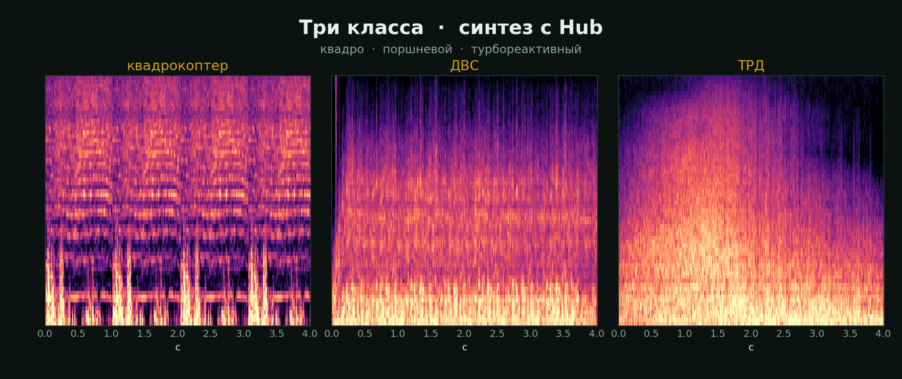
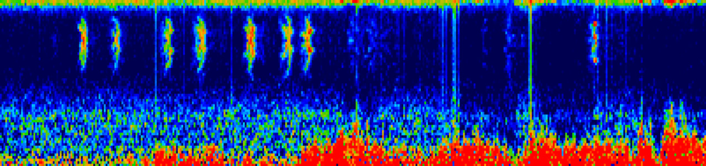
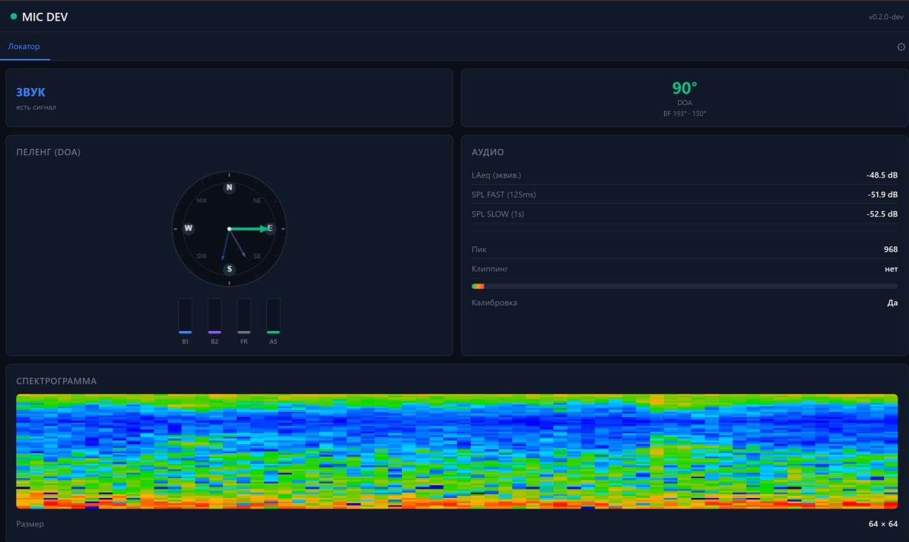

# UAV-radar · NEVOD

**[Русский](#русский)** · **[English](#english)** · **[Landing](https://gfermoto.github.io/UAV-radar/)**

---

<a id="русский"></a>
## Русский

**Лендинг:** [gfermoto.github.io/UAV-radar](https://gfermoto.github.io/UAV-radar/)

Открытая прошивка сетевого микрофона ([MIT](LICENSE)) и материалы для акустического узла **NEVOD** на Seeed XIAO ESP32-S3 и XMOS XVF3800. Открытый mic — Opus, RTSP и WebUI: птицы, природный звук, [BirdNET](https://github.com/kahst/BirdNET-Analyzer). Прошивка датчика — подписанный бинарник с распознанием трёх классов БПЛА на плате.

Сборка в домашних условиях. Узел можно вести **только локально** (WebUI / MQTT / Home Assistant). Чтобы участвовать в **народном радаре** — общем раннем оповещении — нужны Cloud‑токен и координаты; облако не публикует координаты нод, владельцам нод даёт преференции сервиса.

### Что это

**NEVOD** — распределённая акустическая сеть узлов без оптической камеры. Узел можно собрать самостоятельно и подключить к общей сети наблюдения, а не ограничиваться локальным воспроизведением в плеере.

В репозитории две прошивки — не смешивайте:

| Часть | Что даёт |
|-------|----------|
| **Открытая прошивка микрофона** ([MIT](LICENSE), исходники здесь) | Звук → Opus → RTSP и WebUI. Собрали, прошили, открыли `rtsp://…:554/` в плеере или Home Assistant. [Releases](https://github.com/Gfermoto/UAV-radar/releases) · `rtsp-mic-0.3.0.bin`. |
| **Узел NEVOD (датчик)** | Смета [docs/BOM.md](docs/BOM.md), корпус [docs/ENCLOSURE.md](docs/ENCLOSURE.md), подписанный `.bin` — [Releases `nevod-diy-*`](https://github.com/Gfermoto/UAV-radar/releases), полная инструкция DIY [docs/DIY_GUIDE.md](docs/DIY_GUIDE.md) (прошивка, настройка, корпус, ветрозащита). Код модели не открыт, но **три класса БПЛА уже распознаются в бинарнике**. |

Для записи птиц, сада, видеорегистратора или [BirdNET](https://github.com/kahst/BirdNET-Analyzer) достаточно открытой прошивки. Для акустического мониторинга БПЛА в сети NEVOD — прошивка из релиза `nevod-diy-*`.

### Визуализация

**Датчик NEVOD — три класса БПЛА**



Что видит прошивка **`nevod-diy-*`**: три класса механического звука в воздухе. Веса и логика детекции в подписанном `.bin` на Releases, не в git.

**Открытый mic — пение птицы на MEL**



Живой MEL в WebUI открытой прошивки — пример спектрограммы птицы на той же аппаратной платформе.

**WebUI**



Настройка в браузере: уровень, направление (DoA), MEL, луч, Wi‑Fi.

### Что уже можно взять

| Материал | Где |
|----------|-----|
| Лендинг | [gfermoto.github.io/UAV-radar](https://gfermoto.github.io/UAV-radar/) |
| Смета узла DIY | [docs/BOM.md](docs/BOM.md) |
| Корпус (STL) | [docs/ENCLOSURE.md](docs/ENCLOSURE.md) · [релиз](https://github.com/Gfermoto/UAV-radar/releases/tag/nevod-diy-enclosure-v0.1.0) |
| Полная инструкция DIY (прошивка + сборка) | [docs/DIY_GUIDE.md](docs/DIY_GUIDE.md) |
| Бинарник датчика (3 класса БПЛА внутри) | [Releases `nevod-diy-*`](https://github.com/Gfermoto/UAV-radar/releases) |
| Открытый mic (код + `.bin`) | [v0.3.0](https://github.com/Gfermoto/UAV-radar/releases/tag/v0.3.0) |
| Фото сборки | [`img/`](img/) |

### История

Проект начался со стриминга звука неба по RTSP для наблюдения птиц. Позже ту же платформу применили для акустического мониторинга БПЛА: аппаратная часть прежняя, изменились прошивка и сценарий использования. Название UAV-radar отражает этот вектор развития.

### Смежные проекты

| Проект | Ссылка | Назначение |
|--------|--------|------------|
| **BirdLense Hub** | [Gfermoto/BirdLense-Hub](https://github.com/Gfermoto/BirdLense-Hub) | Наблюдение птиц и кормушка — другой канал данных |
| **BirdNET** | [kahst/BirdNET-Analyzer](https://github.com/kahst/BirdNET-Analyzer) · [Cornell](https://birdnet.cornell.edu/) | Распознавание видов по аудиопотоку с mic |

### Открытый mic — возможности

- 16 kHz mono, XVF3800: пеленг (DoA), луч, MEL
- Opus и локальный RTSP (`:554`)
- SPL (A-weighted), WebUI (`:80`), по желанию MQTT / Home Assistant
- Wi‑Fi; опционально Ethernet (W5500)

### Быстрый старт (открытая прошивка)

```bash
pio run -e rtsp_mic
pio run -e rtsp_mic -t upload
pio device monitor -e rtsp_mic
```

- WebUI: `http://<ip>/` — пароль по умолчанию `rtsp-mic-change-me` (**смените**)
- Поток: `rtsp://<ip>:554/`

Пины и сборка: [BUILD.md](BUILD.md). Как устроено внутри: [docs/ARCHITECTURE.md](docs/ARCHITECTURE.md).

### Кольцо светодиодов

На микрофоне — RGB-кольцо с пеленгом (через XVF), на XIAO — свой LED статуса Wi‑Fi. Вкл/выкл кольца в WebUI или `POST /api/system/led` — [docs/LED.md](docs/LED.md).

### Документация

| Файл | О чём |
|------|--------|
| [BUILD.md](BUILD.md) | Сборка, прошивка, пины, тесты |
| [docs/BOM.md](docs/BOM.md) | Смета узла DIY |
| [docs/ENCLOSURE.md](docs/ENCLOSURE.md) | Корпус — STL и печать |
| [docs/DIY_GUIDE.md](docs/DIY_GUIDE.md) | Полная инструкция DIY: прошивка, настройка, корпус |
| [CONTRIBUTING.md](CONTRIBUTING.md) | Что открыто для PR, что нет |
| [SECURITY.md](SECURITY.md) | Сообщения об уязвимостях |
| [docs/ARCHITECTURE.md](docs/ARCHITECTURE.md) | Ядра, звук, задачи |
| [docs/API_REFERENCE.md](docs/API_REFERENCE.md) | MQTT, NVS, команды |
| [openapi-webui.yaml](openapi-webui.yaml) | HTTP API |
| [tools/hil/README.md](tools/hil/README.md) | Проверки на плате |

---

<a id="english"></a>
## English

**Landing:** [gfermoto.github.io/UAV-radar](https://gfermoto.github.io/UAV-radar/)

Open networked mic firmware ([MIT](LICENSE)) and NEVOD acoustic node materials for Seeed XIAO ESP32-S3 + XMOS XVF3800. Open mic: Opus, RTSP, WebUI — birds, nature, [BirdNET](https://github.com/kahst/BirdNET-Analyzer). Sensor firmware: signed binary with on-device recognition of three UAV classes.

Home assembly. The node can run **locally only** (WebUI / MQTT / Home Assistant). To join the **people’s radar** — shared early warning — add a Cloud token and install coordinates; the cloud does **not** publish node coordinates; node owners get service preferences.

### What this is

**NEVOD** is a distributed acoustic network without optical cameras. You can build a node yourself and join a wider monitoring network instead of limiting use to local playback.

Two firmware images in this repo — do not mix them:

| Piece | What you get |
|-------|----------------|
| **Open mic firmware** ([MIT](LICENSE), sources here) | Audio → Opus → RTSP + WebUI. Build, flash, open `rtsp://…:554/` in a player or Home Assistant. [Releases](https://github.com/Gfermoto/UAV-radar/releases) · `rtsp-mic-0.3.0.bin`. |
| **NEVOD node (sensor)** | Parts list [docs/BOM.md](docs/BOM.md), enclosure [docs/ENCLOSURE.md](docs/ENCLOSURE.md), signed `.bin` — [Releases `nevod-diy-*`](https://github.com/Gfermoto/UAV-radar/releases), full DIY guide [docs/DIY_GUIDE.md](docs/DIY_GUIDE.md) (flash, setup, enclosure, wind screen). Model code is not open, but **three UAV classes are already recognized in the binary**. |

Birds, garden, NVR, or [BirdNET](https://github.com/kahst/BirdNET-Analyzer) — the open mic is enough. UAV acoustic monitoring in the NEVOD network — `nevod-diy-*` firmware from Releases.

### Gallery

**NEVOD sensor — three UAV classes**


What **`nevod-diy-*`** listens for: three classes of mechanical sound in the air. Weights and detection logic ship in the signed `.bin` on Releases, not in git.

**Open mic — bird song on MEL**


Live MEL in the open firmware WebUI — bird spectrogram on the same hardware platform.

**WebUI**


Levels, direction of arrival (DoA), MEL, beam, Wi‑Fi — configured in the browser.

### What's already here

| Material | Where |
|----------|-------|
| DIY node parts list | [docs/BOM.md](docs/BOM.md) |
| Enclosure (STL) | [docs/ENCLOSURE.md](docs/ENCLOSURE.md) · [release](https://github.com/Gfermoto/UAV-radar/releases/tag/nevod-diy-enclosure-v0.1.0) |
| Full DIY guide (flash + assembly) | [docs/DIY_GUIDE.md](docs/DIY_GUIDE.md) |
| Sensor `.bin` (3 UAV classes inside) | [Releases `nevod-diy-*`](https://github.com/Gfermoto/UAV-radar/releases) |
| Open mic (sources + `.bin`) | [v0.3.0](https://github.com/Gfermoto/UAV-radar/releases/tag/v0.3.0) |
| Assembly photos | [`img/`](img/) |

### History

The project started with RTSP streaming of overhead sound for bird watching. The same board was later used for UAV acoustic monitoring — same hardware, different firmware and use case. The name UAV-radar reflects that direction.

### Related projects

| Project | Link | Purpose |
|---------|------|---------|
| **BirdLense Hub** | [Gfermoto/BirdLense-Hub](https://github.com/Gfermoto/BirdLense-Hub) | Bird watching and feeder — another data channel |
| **BirdNET** | [kahst/BirdNET-Analyzer](https://github.com/kahst/BirdNET-Analyzer) · [Cornell](https://birdnet.cornell.edu/) | Species ID from the mic audio stream |

### Open mic — features

- 16 kHz mono, XVF3800: DoA, beamforming, MEL
- Opus and local RTSP (`:554`)
- A-weighted SPL, WebUI (`:80`), optional MQTT / Home Assistant
- Wi‑Fi; optional Ethernet (W5500)

### Quick start (open firmware)

```bash
pio run -e rtsp_mic
pio run -e rtsp_mic -t upload
pio device monitor -e rtsp_mic
```

- WebUI: `http://<ip>/` — default password `rtsp-mic-change-me` (**change it**)
- Stream: `rtsp://<ip>:554/`

Pins and build: [BUILD.md](BUILD.md). Internals: [docs/ARCHITECTURE.md](docs/ARCHITECTURE.md).

### LED ring

RGB DoA ring on the mic (via XVF); separate Wi‑Fi status LED on the XIAO. Toggle in WebUI or `POST /api/system/led` — [docs/LED.md](docs/LED.md).

### Docs

| File | About |
|------|--------|
| [BUILD.md](BUILD.md) | Build, flash, pins, tests |
| [docs/BOM.md](docs/BOM.md) | DIY node parts list |
| [docs/ENCLOSURE.md](docs/ENCLOSURE.md) | Enclosure STL / print |
| [docs/DIY_GUIDE.md](docs/DIY_GUIDE.md) | Full DIY guide: flash, setup, enclosure |
| [CONTRIBUTING.md](CONTRIBUTING.md) | What is open for PRs |
| [SECURITY.md](SECURITY.md) | Vulnerability reporting |
| [docs/ARCHITECTURE.md](docs/ARCHITECTURE.md) | Cores, audio path, tasks |
| [docs/API_REFERENCE.md](docs/API_REFERENCE.md) | MQTT, NVS, commands |
| [openapi-webui.yaml](openapi-webui.yaml) | HTTP API |
| [tools/hil/README.md](tools/hil/README.md) | On-device checks |
