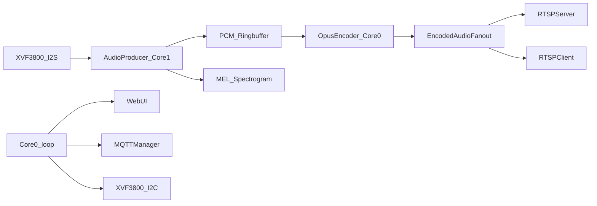

# Архитектура · Architecture

**[Русский](#русский)** · **[English](#english)**

Открытая прошивка mic на Seeed XIAO ESP32-S3 + XMOS XVF3800 — открытый поток и аппаратная платформа узла NEVOD. Порядок init: [`src/main.cpp`](../src/main.cpp). Светодиоды: [LED.md](LED.md). HTTP: [`openapi-webui.yaml`](../openapi-webui.yaml). MQTT/NVS: [API_REFERENCE.md](API_REFERENCE.md).

Контекст: [README](../README.md) · [BirdLense Hub](https://github.com/Gfermoto/BirdLense-Hub) · [BirdNET](https://github.com/kahst/BirdNET-Analyzer)

---

## Русский

### Роли железа

| Часть | Роль |
|-------|------|
| **XVF3800** | 4 микрофона, AEC/AGC/луч/DoA, HPF на чипе, I2S → ESP, I2C `0x2C` |
| **ESP32-S3** | захват I2S, MEL, Opus, RTSP, WebUI, MQTT, опц. W5500 |
| **GPIO21** | статусный LED XIAO (не RGB-кольцо mic) |
| **RGB ring** | 12× WS2812 на Seeed; `LED_EFFECT` через I2C GPO |

### Правило двух ядер

**Core 1 — только realtime-аудио. Core 0 — сеть и управление.**  
На Core 1 нельзя вешать Wi‑Fi / TCP / блокирующий host-I2C сети.

### Пайплайн аудио

1. I2S DMA 16 kHz, 32-bit stereo → mono int16  
2. `AudioProducer` (Core 1) → lock-free ring + телеметрия + MEL (FFT 512, 64 полос)  
3. HPF: при живом XVF — только чип; soft filter — только если чип не инициализирован  
4. `OpusEncoder` (Core 0) → Opus 20 ms / 32 kbps  
5. `EncodedAudioFanout` → локальный RTSP и опц. remote client (drop-oldest)  
6. RTP через `RtspRuntimeCore`; слушать `:554`

Живой MEL в WebUI (птица): [`img/bird.jpg`](../img/bird.jpg). Три класса БПЛА в бинарнике NEVOD: [`img/tri_klassa.png`](../img/tri_klassa.png). Галерея: [README](../README.md).

### Задачи FreeRTOS (типично)

Приоритеты в [`Config.h`](../src/Config.h): audio `10`, network `5`.

| Задача | Core | Модуль |
|--------|------|--------|
| AudioProducer | 1 | `AudioProducer` |
| Opus encode | 0 | `OpusEncoder` |
| RTSP server / client | 0 | `RTSPServer` / `RTSPClient` |
| WebUI | 0 | `WebUI` |
| MQTT | 0 | `MQTTManager` |
| SystemMonitor / sensorPoll | 0 | `SystemMonitor` / `main` |
| `loop()` | 0 | Wi‑Fi recovery, NTP, LED, MQTT.update |

Стеки: audio 8K, network 4K, Opus 48K, WebUI 12K.

### Lifecycle

`AudioLifecycle` — согласованный pause/stop/start при нагреве и OTA.  
`TcpBudget` — лимит одновременных RTSP TCP (защита lwIP PCB).

### Сеть и UI

Captive Wi‑Fi (`192.168.4.1`, `RTSPMIC-*`), опц. Ethernet, WebUI Basic+CSRF+WS ticket, общие пароли Web/RTSP, MQTT `rtsp-mic/v1/{node_id}/…`.

### Конфиг

NVS **`rtspmic`**. Константы: `Config.h` + `ConfigDev.h`. По возможности `NetConfig::softApply` без полного reboot.

### Правила для контрибьюторов

1. Не ставить сеть на Core 1.  
2. Новые consumer Opus → только через `EncodedAudioFanout`.  
3. Команды → `CommandDispatcher`.  
4. Публичный HTTP ↔ `openapi-webui.yaml`.  
5. Смена schema NVS → миграция / factory reset ([BUILD.md](../BUILD.md)).

---

## English

### Hardware roles

| Part | Role |
|------|------|
| **XVF3800** | 4-mic array, AEC/AGC/beam/DoA, on-chip HPF, I2S → ESP, I2C `0x2C` |
| **ESP32-S3** | I2S capture, MEL, Opus, RTSP, WebUI, MQTT, optional W5500 |
| **GPIO21** | XIAO status LED (not the mic RGB ring) |
| **RGB ring** | 12× WS2812 on Seeed; `LED_EFFECT` via I2C GPO |

### Dual-core rule

**Core 1 — realtime audio only. Core 0 — network and control.**  
Core 1 must not do Wi‑Fi / TCP / blocking host I2C for the network stack.

### Audio pipeline

1. I2S DMA 16 kHz, 32-bit stereo → mono int16  
2. `AudioProducer` (Core 1) → lock-free ring + telemetry + MEL (FFT 512, 64 bands)  
3. HPF: live XVF → chip only; soft filter only if chip not initialized  
4. `OpusEncoder` (Core 0) → Opus 20 ms / 32 kbps  
5. `EncodedAudioFanout` → local RTSP and optional remote client (drop-oldest)  
6. RTP via `RtspRuntimeCore`; listen `:554`

Live MEL (bird): [`img/bird.jpg`](../img/bird.jpg). Three UAV classes in NEVOD binary: [`img/tri_klassa.png`](../img/tri_klassa.png). Gallery: [README](../README.md).

### FreeRTOS tasks (typical)

Priorities in [`Config.h`](../src/Config.h): audio `10`, network `5`.

| Task | Core | Module |
|------|------|--------|
| AudioProducer | 1 | `AudioProducer` |
| Opus encode | 0 | `OpusEncoder` |
| RTSP server / client | 0 | `RTSPServer` / `RTSPClient` |
| WebUI | 0 | `WebUI` |
| MQTT | 0 | `MQTTManager` |
| SystemMonitor / sensorPoll | 0 | `SystemMonitor` / `main` |
| `loop()` | 0 | Wi‑Fi recovery, NTP, LED, MQTT.update |

Stacks: audio 8K, network 4K, Opus 48K, WebUI 12K.

### Lifecycle

`AudioLifecycle` — ordered pause/stop/start for thermal and OTA.  
`TcpBudget` — caps concurrent RTSP TCP accepts (lwIP PCB).

### Network & UI

Wi‑Fi captive (`192.168.4.1`, `RTSPMIC-*`), optional Ethernet, WebUI Basic+CSRF+WS ticket, shared Web/RTSP credentials, MQTT `rtsp-mic/v1/{node_id}/…`.

### Config

NVS namespace **`rtspmic`**. Compile-time: `Config.h` + `ConfigDev.h`. Prefer `NetConfig::softApply` when a full reboot is not needed.

### Contributor rules

1. No network I/O on Core 1.  
2. New Opus consumers → `EncodedAudioFanout`, not a private encoder hook.  
3. Commands → `CommandDispatcher`.  
4. Public HTTP ↔ `openapi-webui.yaml`.  
5. NVS schema bumps → migration / factory reset ([BUILD.md](../BUILD.md)).
