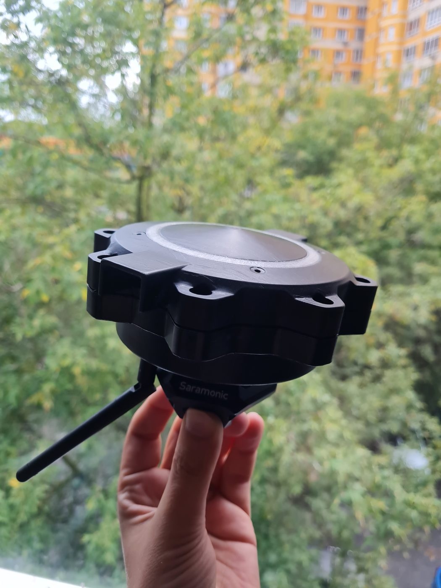
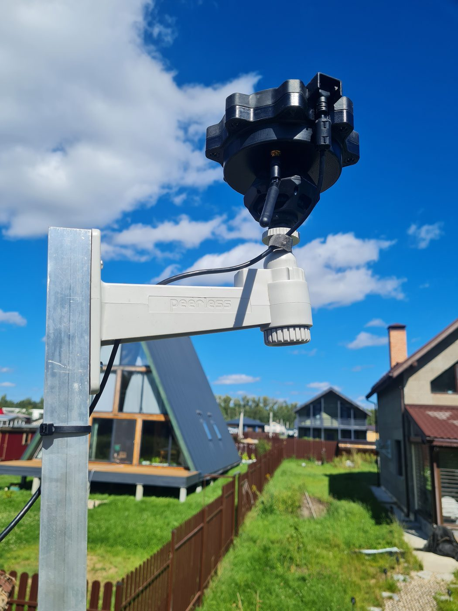
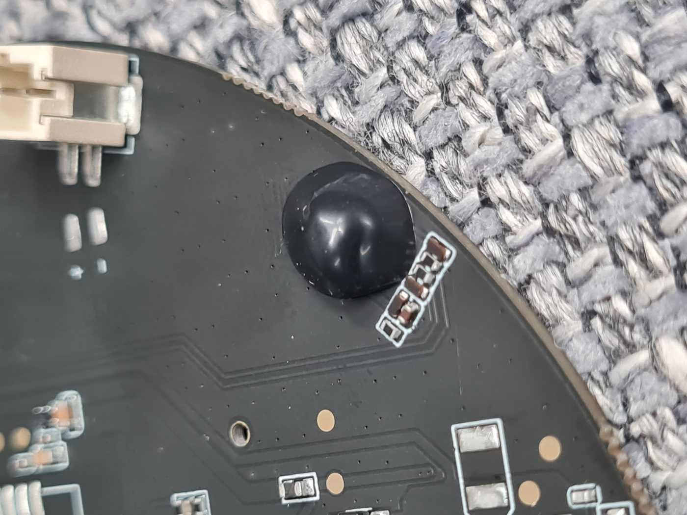
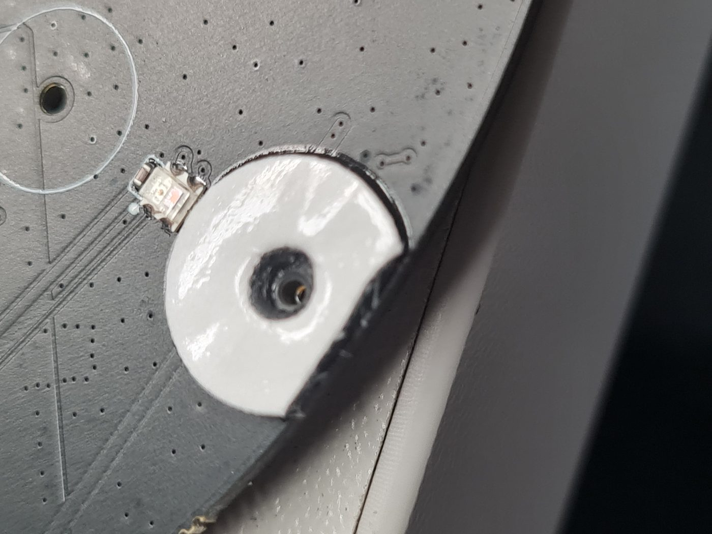
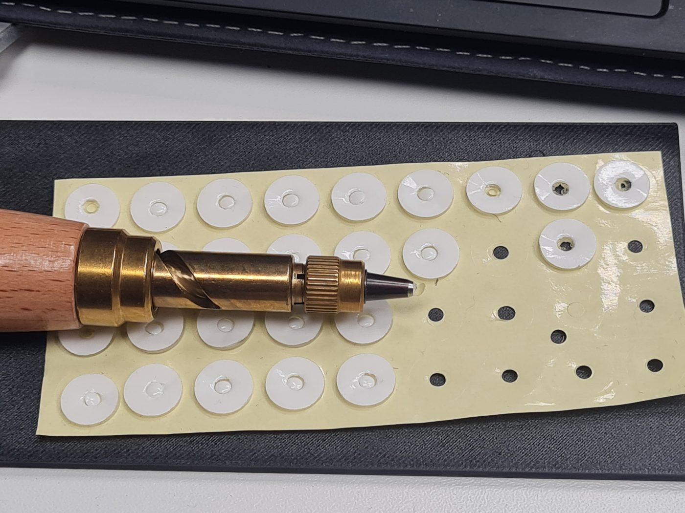
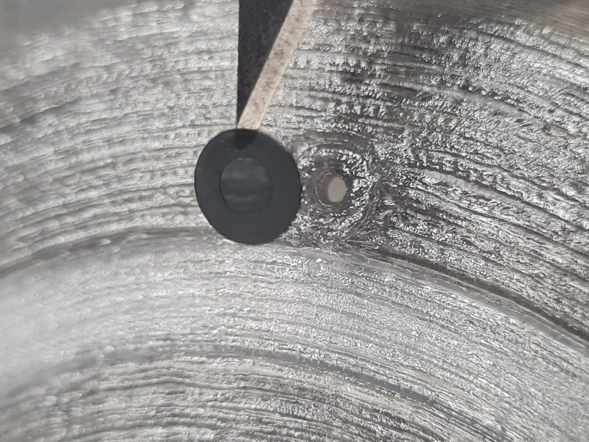
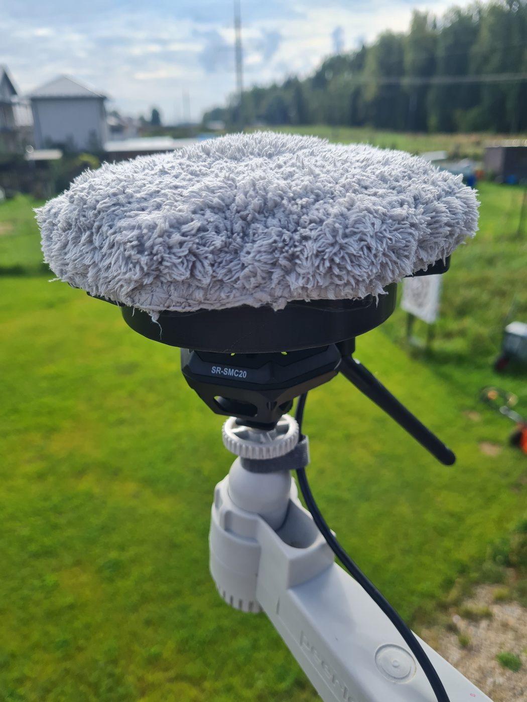

# Сборка и прошивка NEVOD DIY · Build & flash NEVOD DIY

**[Русский](#русский)** · **[English](#english)**

Готовый бинарник: [Releases](https://github.com/Gfermoto/UAV-radar/releases) → последний тег **`nevod-diy-*`**.  
Смета: [BOM.md](BOM.md). Корпус (STL): [ENCLOSURE.md](ENCLOSURE.md).

**Полная инструкция DIY** — от чипа XVF и ESP до корпуса, ветрозащиты и монтажа на месте. Не только прошивка.

Железо: **Seeed XIAO ESP32-S3** + **ReSpeaker XVF3800** (4 микрофона).  
Три класса БПЛА распознаются **на плате** (модель уже внутри `.bin`). Схема: [`img/tri_klassa.png`](../img/tri_klassa.png).

Делайте по порядку. Не перескакивайте шаги «на потом» — потом сложнее отладить.

| Шаг | Содержание |
|-----|------------|
| 1–2 | Прошивка XVF и ESP |
| 3–4 | Wi‑Fi, WebUI, калибровка |
| 5 | OTA |
| 6 | Локально (HA) и/или народный радар (токен + координаты) |
| 7 | Корпус, фото сборки, ветрозащита, монтаж |

**Открыто / закрыто:** исходники RTSP Mic — MIT в этом репозитории. Детекция БПЛА — в подписанном `.bin` (модель и логика закрыты). Проверка sha256 — в шаге 2 и в `manifest.json` релиза.

---

<a id="русский"></a>
## Русский

### Две прошивки — не смешивайте

| Прошивка | Зачем |
|----------|--------|
| **RTSP Mic** ([v0.3.0](https://github.com/Gfermoto/UAV-radar/releases/tag/v0.3.0)) | Открытый микрофон (MIT): птицы, BirdNET |
| **NEVOD DIY** (`nevod-diy-*`) | Детекция БПЛА |

Образы **разные**. NEVOD DIY полностью заменяет RTSP Mic — не заливайте «оба».

---

### Что купить и что подготовить

1. Комплект платы по [BOM](BOM.md) (XIAO + XVF3800).
2. USB‑кабель **с данными** (дешёвые «только зарядка» не подойдут).
3. Компьютер: Windows / Linux / macOS.
4. [esptool](https://docs.espressif.com/projects/esptool/en/latest/esp32s3/): `pip install esptool`.
5. Из релиза NEVOD DIY три файла:
   - `firmware-nevod_diy.bin`
   - `firmware-nevod_diy.bin.sig`
   - `firmware-nevod_diy.bin.manifest.json`
6. Домашний Wi‑Fi **только 2.4 ГГц** (плата не видит 5 ГГц).
7. Для калибровки громкости — **любой шумомер** (бытовой ок, лучше с A‑взвешиванием / LAeq). Без него узел работает, но цифры «дБ» на экране будут условными.
8. Телефон или ноутбук для настройки Wi‑Fi.

**Два разных USB‑C на плате — не перепутайте:**

| Разъём | Куда смотреть | Зачем |
|--------|----------------|--------|
| Рядом с **гнездом 3.5 mm** | сторона XVF | прошивка микрофонного чипа |
| На модуле **XIAO** | маленькая плата | питание + прошивка ESP + Serial |

---

### 1. Микрофонный чип (XVF3800) — один раз

Нужна прошивка Seeed: **I²S, slave, 16 кГц**.

Скачать:  
[`application_xvf3800_i2s_slave_v1.0.8_16k.bin`](https://github.com/respeaker/reSpeaker_XVF3800_USB_4MIC_ARRAY/raw/master/xmos_firmwares/i2s/application_xvf3800_i2s_slave_v1.0.8_16k.bin)  
(репозиторий [reSpeaker XVF3800](https://github.com/respeaker/reSpeaker_XVF3800_USB_4MIC_ARRAY)).

Инструмент: [dfu-util](https://dfu-util.sourceforge.net/) (часто `dfu-util-static.exe` в поставке Seeed).

Многие комплекты уже с нужным образом. **Перешивайте только если версия прошивки чипа не 1.0.8** (нужен именно `…_i2s_slave_v1.0.8_16k`). Не ориентируйтесь на «тишину» в WebUI — сначала проверьте/поставьте **1.0.8**.

**Не берите** файл *I²S master / 48 kHz* — с этим комплектом звук обычно пропадает.

```bat
dfu-util-static.exe -l
dfu-util-static.exe -d 2886:001a -t 4096 -a 1 -D application_xvf3800_i2s_slave_v1.0.8_16k.bin
```

Пошагово:

1. Кабель в USB‑C **у 3.5 mm**.
2. Плата в режиме DFU (как в инструкции Seeed к ReSpeaker).
3. Пишите в слот **Upgrade** (`-a 1`), не Factory (`-a 0`).
4. Дождитесь 100% и Done. Выньте/вставьте питание.
5. Если `LIBUSB_ERROR_TIMEOUT` — **не** долбите retry: закройте dfu-util, выдерните кабель ~10 с, потом **одна** новая попытка.

SHA-256 образа Seeed: `9dc3308a4db8570603bcc88103d2f0de0291cc92a384d2b25de6eef6f2d99eb8`.

---

### 2. Прошивка ESP (XIAO)

1. Скачайте последний [`nevod-diy-*`](https://github.com/Gfermoto/UAV-radar/releases).
2. Проверьте файл:

```bash
sha256sum firmware-nevod_diy.bin
# сумма должна совпасть с полем sha256 в firmware-nevod_diy.bin.manifest.json
```

3. Кабель — в USB‑C **на XIAO** (не у 3.5 mm).
4. Узнайте порт: Linux `/dev/ttyACM0`, Windows `COMx` (Диспетчер устройств → порты).
5. Если порт не появляется: зажмите **BOOT** на XIAO → коротко **RESET** → отпустите **BOOT**.
6. Прошейте:

```bash
esptool.py --chip esp32s3 --port /dev/ttyACM0 --baud 921600 \
  write_flash 0x0 firmware-nevod_diy.bin
```

Windows: замените порт на `COM5` (свой номер).

**Важно:** запись с `0x0` **стирает** сохранённый Wi‑Fi и настройки. После полной прошивки сеть настраиваете заново (шаг 3).

Дождитесь `Hash of data verified` / Leaving. Отключите и снова подайте питание (или RESET).

---

### 3. Первое включение и Wi‑Fi

#### 3.1. Точка доступа платы

После прошивки без сохранённой сети плата поднимает **свою** Wi‑Fi точку.

| | Как на самом деле |
|--|--|
| **Имя сети (SSID)** | `NV` + 8 символов из MAC, например `NV2C46E4AB` |
| **Регистр** | **ЗАГЛАВНЫЕ** латинские буквы и цифры (`NV`, `A–F`) |
| **Пароль** | **точно такой же**, как SSID, **включая регистр** |
| **Адрес портала** | `http://192.168.4.1` |

Пример: если в списке сетей видите `NV2C46E4AB`, пароль — тоже `NV2C46E4AB` (не `nv…`, не `admin`, не пустой).

На телефоне:

1. Подключитесь к `NV…`.
2. Если браузер сам не открыл страницу — вручную наберите **`http://192.168.4.1`**.
3. Выберите **домашнюю сеть 2.4 ГГц**, введите пароль Wi‑Fi, сохраните.
4. Плата перезапустит Wi‑Fi и уйдёт с точки `NV…`. Телефон снова в домашний Wi‑Fi.

Не видите `NV…`? Подождите 30–60 с после RESET. Сеть 5 ГГц / гостевая с «только 5 GHz» не подойдёт для следующего шага — роутеру нужна раздача 2.4.

#### 3.2. Вход в WebUI

Узнайте IP платы в роутере (клиент `nv…` / Espressif) **или** откройте:

`http://nv….local/`  

Hostname — **тот же идентификатор, но строчными**: SSID `NV2C46E4AB` → `http://nv2c46e4ab.local/`.

| | |
|--|--|
| Логин | `admin` |
| Пароль по умолчанию | `nevod-change-me` (латиница, дефисы, без пробелов) |

**Сразу смените пароль** во вкладке **Система**. Правила: ≥ 8 символов, без двоеточия `:`.

Пока пароль заводской:

- часть настроек не сохранится (`must_change_password`);
- баннер «смените пароль» — это нормально, вы уже внутри.

Если «не пускает» после нескольких ошибок — подождите **~60 секунд** (временная блокировка), откройте окно инкогнито.

В статусе / на дашборде версия прошивки должна совпасть с релизом (поле `version` в `manifest.json`).

#### 3.3. Быстрая проверка «жив ли слух»

1. На дашборде должны обновляться уровень / спектр / азимут.
2. Хлопните в ладоши сбоку от платы — азимут и уровень должны дёрнуться.
3. Кольцо LED на XVF обычно реагирует на активность (если прошивка чипа верная).

Тишина после хлопков → вернитесь к шагу 1 (образ I²S slave 16 kHz) и проверьте кабель XIAO.

---

### 4. Калибровка по шумомеру (обязательно для честных «дБ»)

Без калибровки детекция работает, но **цифры LAeq / SPL на экране и в MQTT не абсолютные**. Заводской офсет — лишь стартовая точка.

Нужно:

- бытовой **шумомер** (лучше A‑weighted / LAeq);
- тихое место или стабильный фон (вентилятор, розовый шум из телефона на средней громкости — лишь бы уровень не прыгал);
- WebUI → вкладка аудио / блок **«Калибровка микрофона»** → ползунок **Смещение (dB)**.

Как сделать:

1. Оставьте AGC **выключенным** (так по умолчанию после прошивки) — иначе уровень «плывёт».
2. Поставьте шумомер рядом с платой (примерно на высоте микрофонов, не закрывая их рукой).
3. Подождите 10–20 с, пока успокоятся показания.
4. Считайте с шумомера уровень **M** (дБ).
5. В WebUI смотрите **LAeq** (или SPL) — это **L**.
6. Правило:  
   **новое смещение = старое смещение + (M − L)**  
   Пример: шумомер 52 дБ, на экране 40, смещение было −30 → новое ≈ −30 + 12 = **−18**.
7. Двигайте ползунок, нажмите **Применить**, подождите несколько секунд, сравните снова.
8. Повторите, пока M и L не совпадут в пределах ~1–2 дБ.

Если ползунка (−60…+60) не хватает — сначала чуть уменьшите **чувствительность микрофона** на той же вкладке, снова Применить, потом добейте смещением.

Подсказка в интерфейсе: «Офсет по эталонному шумомеру. Если не хватает — снизьте чувствительность микрофона.»

---

### 5. Обновления прошивки (OTA)

После настройки Wi‑Fi узел может проверять обновления **сам** — без USB.

1. WebUI → вкладка **OTA** / Система → **Проверить обновления** (GitHub).
2. Канал: репозиторий [UAV-radar Releases](https://github.com/Gfermoto/UAV-radar/releases) (floating `diy-ota`, versioned `nevod-diy-*`).
3. Не делайте `erase_flash` / factory wipe «на всякий случай» — сотрёте Wi‑Fi.

USB-прошивка из Releases остаётся запасным путём (шаг 2).

---

### 6. Два пути: двор (HA) и народный радар (облако)

Узел **можно** использовать только локально: MQTT / Home Assistant Discovery на вкладке **Интеграции** — алерты у вас дома, без облака NEVOD.

Чтобы радар стал **народным** — общим ранним оповещением для людей вокруг — нужны ещё два шага:

1. Зарегистрируйтесь / войдите в кабинет: [https://nevod.endorphine.agency](https://nevod.endorphine.agency).
2. Скопируйте **свой** Cloud‑токен и в WebUI → **Интеграции → Облако (Cloud)**:
   - вставьте токен (без слова `Bearer`);
   - **замените** заводской по умолчанию;
   - сохраните / подключите — дождитесь успешной связи.
3. **Система → GPS / координаты**: задайте **широту, долготу и высоту** места установки. Сохраните.

**Зачем облако:** оно даёт людям раннее оповещение и возможность среагировать.  
**Приватность:** облако **не выдаёт координаты нод** публично.  
**Владельцам нод** облако даёт **преференции** по сравнению с обычными пользователями (приоритет/возможности сервиса для тех, кто держит узел в сети).

Без токена и координат узел остаётся полезным локально (WebUI / HA), но не участвует в общей сети оповещения.

Обычный режим платы — **детекция**. Режим настройки микрофона / RTSP — только чтобы подкрутить звук на столе, не для круглосуточного поля.

---

### 7. Сборка корпуса

Сначала закончите прошивку и настройку (шаги 1–6) **на открытой плате**.  
Детали корпуса: [ENCLOSURE.md](ENCLOSURE.md) · релиз [STL](https://github.com/Gfermoto/UAV-radar/releases/tag/nevod-diy-enclosure-v0.1.1).  
Мелочёвка из [BOM](BOM.md): жидкая изолента, клейкие шайбы/скотч, сетки IP65, USB‑C, антенна, кронштейн ¼″, опционально виброразвязка.

Так выглядит собранный узел (ориентир по результату):





#### 7.0. Печать и химическая постобработка

> **Безопасность.** Пары ацетона, ТГФ и хлористого метилена токсичны и огнеопасны. Работайте только с **вытяжкой**, в **перчатках**, без открытого огня и нагревателей рядом. Не делайте химическое сглаживание, если нет опыта и нормальной вентиляции — можно оставить корпус «как с принтера».

**Летний комплект (рекомендуется):** `nevod-diy-body-v0.1.3.stl` + `nevod-diy-lid-monoblock-v0.1.2.stl` + gasket/led-ring **0.1.0** — см. [ENCLOSURE.md](ENCLOSURE.md). Body **0.1.3** лучше держит салфетку ветрозащиты; monoblock — одна деталь сверху (проще герметизация; DoA через AMS, прозрачный пруток слои **91–105** при 0.2 мм). Базовые body/lid **0.1.0** остаются в дереве.

Печатайте body / lid из **ASA** или **PETG**; **LED‑ring** — из **прозрачного** или **матового просвечивающегося** филамента **того же состава**, что и корпус (ASA к ASA, PETG к PETG); уплотнитель между корпусом и крышкой — **TPU** (химией не обрабатывают) **либо** резиновая прокладка / **O‑ring** того же посадочного размера вместо печати.

1. **Закладные втулки** (heat‑set) впаяйте **до** химической обработки — после пара/растворителя посадка хуже и деталь уже «мягче».
2. **Отверстия под LED** (изнутри корпуса): перед паровой обработкой **прокапайте** их изнутри подходящим растворителем (см. ниже) — так канал/кромка проясняется и не «зарастает» при сглаживании снаружи.
3. Сглаживание **снаружи** (вытяжка, перчатки, без открытого огня; пары вредны):

| Материал | Снаружи (пар) | Прокапать отверстия под LED изнутри |
|----------|----------------|--------------------------------------|
| **ASA** | ацетоновый пар | ацетон |
| **PETG** | пар **ТГФ** (тетрагидрофуран) | **хлористый метилен** (дихлорметан) |

4. После химии корпус должен **отлежаться не меньше суток**, и только потом — полная сборка с платой (п. 7.1+).

TPU‑прокладку (и резиновый уплотнитель / O‑ring) и электронику в камеру с парами **не** кладите.

#### 7.1. Подготовка платы

**а) Жидкая изолента (сторона с компонентами / XIAO)**  
Акустические отверстия — **с другой** стороны платы; их не трогайте.  
На стороне с деталями и XIAO **полностью накройте капсюль** каплей жидкой изоленты так, чтобы она **стекла на плату** вокруг корпуса микрофона. Капля должна закрыть весь капсюль и приклеить его к плате — так герметизируется стык и отсекается шум с тыла. Не лейте в отверстия на обратной стороне и не заливайте разъёмы / контактные площадки XIAO.



**б) Канал к диафрагме (обратная сторона платы)**  
С другой стороны платы — отверстия, через которые диафрагмы слышат снаружи. Они должны **совпасть** с отверстиями в корпусе и дать **герметичный** канал:

1. В корпусе (низ) разверните акустические отверстия сверлом до **~2 мм**.
2. Из двустороннего скотча (или прозрачных клейких шайб из BOM) вырежьте кружочки («колечки»).



3. **Только дыроколом** сделайте в центре каждого кольца отверстие **~1.5 мм**. Шилом нельзя — рвёт клейкий слой, канал получается неровным.



4. Наклейте кольца **над микрофонами** на плате (со стороны отверстий к диафрагме) — клей к корпусу, воздух идёт через 1.5 мм.

#### 7.2. Сборка внутренняя

**а)** Уложите плату в корпус **без смещения**, сразу попадая отверстиями на канал. Скотч/колечки мешают плате «поплыть» вбок.  
**б)** Прикрутите плату **тремя винтами** (втулки/винты M2 из BOM / комплекта корпуса).  
**в) Опционально — внешняя антенна Wi‑Fi (SMA):**  
разверните отверстие в корпусе сверлом; снаружи **O‑ring 6 мм**; установите разъём SMA; кабель U.FL/IPEX подключите к XIAO, **сняв заводской антенный джампер** на модуле.  
**г)** Установите уплотнитель между корпусом и крышкой: **TPU** из печати **или** резиновую прокладку / **O‑ring** соответствующего размера. **Перед сборкой** слегка обработайте кольцо или прокладку **силиконовой смазкой** (и печатный TPU, и резину).  
**д)** Положите внутрь маленький пакетик **силикагеля**.

Перед закрытием крышки ещё раз проверьте WebUI / хлопок по Wi‑Fi.

#### 7.3. Сборка наружная

**а)** Закройте корпус крышкой и стяните **8 винтами**.  
**б)** Над отверстиями микрофонов снаружи наклейте **сетчатые акустические мембраны IP65** (4 шт. из BOM).



**в)** Вставьте и прикрутите уличный **USB‑C** (из BOM); уплотнительное кольцо **O-ring 5 мм**.  
**г)** Прикрутите антенну Wi‑Fi **к SMA** (из п. 7.2.в; **O-ring 6 мм**).

#### 7.4. Летняя ветрозащита

Для уличной установки летом накройте микрофоны лёгкой **ветрозащитой** из салфеток для робота‑мойщика окон (тонкая нетканка): она гасит шум ветра и не перекрывает акустический канал так же сильно, как плотный поролон. Низ корпуса **body 0.1.3** лучше фиксирует салфетку, чем body 0.1.0.



**Водоотталкивающая обработка:** верх корпуса (крышку) и ветрозащиту сверху рекомендуется обработать **водоотталкивающим спреем для замши** — меньше намокание и «залипание» влаги на ткани. Наносите по инструкции к спрею, не заливайте акустические отверстия с избытком.

Зимняя ветрозащита — отдельный follow‑up (см. [ENCLOSURE.md](ENCLOSURE.md)); в текущем STL её нет.

#### 7.5. Установка на месте

- Повесьте узел **повыше** на **открытой** площадке (не в «колодце» между стенами).
- Крепление **¼″** — через **виброразвязку** (опция из BOM, напр. Saramonic SR‑SMC20, или аналог на ¼″). Жёстко к металлу без развязки — лишний конструкционный шум.
- Ориентация: **разъёмом USB на Юг**.
- **Не** ставьте вровень с **козырьком крыши** — там сильная турбулентность и ложный шум ветра.
- Wi‑Fi до роутера по возможности уверенный (ориентир не хуже примерно −75 dBm).

---

### Чеклист «можно вешать»

- [ ] Чип XVF — I²S slave **v1.0.8** 16 kHz  
- [ ] ESP прошит из `nevod-diy-*`, sha256 совпал с manifest  
- [ ] Зашли в AP `NV…` с паролем **как SSID, ЗАГЛАВНЫМИ**  
- [ ] Домашний Wi‑Fi 2.4 ГГц, WebUI открывается  
- [ ] Пароль `admin` сменён с `nevod-change-me`  
- [ ] Хлопок двигает азимут / уровень  
- [ ] Калибровка по шумомеру сделана (или осознанно отложена)  
- [ ] MQTT / Home Assistant настроены **или** осознанно не нужны (локальный двор)  
- [ ] Для народного радара: свой Cloud‑токен + широта/долгота/высота  
- [ ] Втулки впаяны **до** химии; ASA/PETG обработаны; отлёжка ≥ суток  
- [ ] Жидкая изолента + клейкие «колечки» 1.5 мм / отверстия корпуса ~2 мм  
- [ ] Плата на трёх винтах; уплотнитель TPU **или** резиновый O‑ring / прокладка — со **силиконовой смазкой**; силикагель внутри  
- [ ] 8 винтов крышки M3×19 + гайки M3, сетки IP65, USB‑C (O‑ring 5 мм), антенна (O‑ring 6 мм)  
- [ ] Летняя ветрозащита (салфетки для робота‑мойщика окон)  
- [ ] Верх корпуса и ветрозащита — водоотталкивающий спрей для замши  
- [ ] Установка через виброразвязку ¼″; разъёмом USB на Юг; не у кромки козырька  

---

### Если что-то сломалось

| Симптом | Что проверить |
|---------|----------------|
| Нет `/dev/ttyACM*` / COM | Data‑кабель; BOOT+RESET; другой USB‑порт |
| Нет сети `NV…` | Подождать после RESET; питание на XIAO |
| AP есть, пароль не подходит | Регистр: только как на экране, **заглавные** |
| Портал не открывается | Вручную `http://192.168.4.1` |
| WebUI 401 / блокировка | Пароль `nevod-change-me`; пауза 60 с; инкогнито |
| Нет звука / азимута | Версия XVF **не 1.0.8** → шаг 1; кабель XIAO; mic gain |
| Цифры дБ «врут» | Калибровка (шаг 4); AGC выкл при сверке |

Сброс к «как после прошивки»: кнопка **BOOT** (удержание после старта) или WebUI → Система → Factory reset (нужен уже новый пароль). Снова шаг 3.

---

### Поддержка

[Issues](https://github.com/Gfermoto/UAV-radar/issues) · новости: [Telegram @UAV_radar](https://t.me/UAV_radar).  
Логика детекции и облака — в закрытом бинарнике. Открытый RTSP Mic в репозитории — MIT.

---

<a id="english"></a>
## English

### Two firmwares — do not mix

| Firmware | Purpose |
|----------|---------|
| **RTSP Mic** ([v0.3.0](https://github.com/Gfermoto/UAV-radar/releases/tag/v0.3.0)) | Open MIT mic — birds / BirdNET |
| **NEVOD DIY** (`nevod-diy-*`) | On-device UAV detection |

NEVOD DIY **fully replaces** RTSP Mic.

### Gear

Kit from [BOM](BOM.md), data USB cable, `pip install esptool`, latest `nevod-diy-*` assets, **2.4 GHz** Wi‑Fi, optional SPL meter for calibration.

Two USB‑C ports: **3.5 mm side** = mic chip DFU; **XIAO** = power + ESP flash.

### 1. Mic chip (once)

Flash Seeed **I²S slave 16 kHz v1.0.8**  
([bin](https://github.com/respeaker/reSpeaker_XVF3800_USB_4MIC_ARRAY/raw/master/xmos_firmwares/i2s/application_xvf3800_i2s_slave_v1.0.8_16k.bin)).  
**Reflash only if the chip firmware is not 1.0.8** — do not decide from WebUI silence alone.  
DFU **alt=1** only. Do **not** use I²S master 48 kHz.  
On `LIBUSB_ERROR_TIMEOUT`: unplug ~10 s, one retry.

### 2. Flash ESP

Cable on **XIAO**. Verify sha256 vs `manifest.json`. Then:

```bash
esptool.py --chip esp32s3 --port /dev/ttyACM0 --baud 921600 \
  write_flash 0x0 firmware-nevod_diy.bin
```

`0x0` write **erases** Wi‑Fi settings. BOOT+RESET if the port is missing.

### 3. First Wi‑Fi

| | |
|--|--|
| AP SSID | `NV` + hex from MAC, e.g. `NV2C46E4AB` |
| Case | **UPPERCASE** letters |
| AP password | **Identical to SSID** (same case) |
| Portal | `http://192.168.4.1` |

Join `NV…` → pick home **2.4 GHz** Wi‑Fi → save.  
WebUI: `http://nv….local/` (lowercase) or LAN IP.  
Login **`admin` / `nevod-change-me`** — **change immediately** (System).  
Clap test: level / DoA must move.

### 4. Calibrate with an SPL meter

Detection works without this; **dB numbers do not** until you calibrate.

WebUI → **Microphone Calibration** → **Offset (dB)**. Keep AGC **off**.

**new_offset ≈ old_offset + (meter_dB − WebUI_LAeq)**  
Apply, wait, repeat until within ~1–2 dB. If the slider runs out, lower mic sensitivity first.

### 5. Firmware updates (OTA)

After Wi‑Fi is up, the node can check for updates **without USB**.

1. WebUI → **OTA** / System → **Check updates** (GitHub).
2. Channel: [UAV-radar Releases](https://github.com/Gfermoto/UAV-radar/releases) (floating `diy-ota`, versioned `nevod-diy-*`).
3. Do **not** run `erase_flash` / factory wipe “just in case” — that wipes Wi‑Fi.

USB flash from Releases remains the fallback (step 2).

### 6. Two paths: yard (HA) and people’s radar (cloud)

You **can** run the node locally only: MQTT / Home Assistant Discovery under **Integrations** — alerts at home, no NEVOD cloud.

To join the **people’s radar** — shared early warning for people around you — do two more things:

1. Sign in at [https://nevod.endorphine.agency](https://nevod.endorphine.agency) and copy **your** Cloud token.
2. WebUI → **Integrations → Cloud**: paste the token (no `Bearer`), **replace the default**, save/connect.
3. **System → GPS**: set **latitude, longitude, and altitude**; save.

**Why cloud:** early warning so people can react.  
**Privacy:** the cloud does **not** publish node coordinates.  
**Node owners** get **preferences** in the service compared with regular (non-owner) users.

Without token + coordinates the node stays useful locally (WebUI / HA) but does not join the shared warning network.

Default mode is **detection**. Mic-setup / RTSP is for bench tuning only, not 24/7 field use.

### 7. Enclosure build

Finish steps 1–6 on the open board first. Parts: [ENCLOSURE.md](ENCLOSURE.md) · [STL release](https://github.com/Gfermoto/UAV-radar/releases/tag/nevod-diy-enclosure-v0.1.1). Consumables: [BOM](BOM.md).

Assembled node (what you are aiming for):


**7.0 Print / chemical finish.** **Summer kit (recommended):** `nevod-diy-body-v0.1.3.stl` + `nevod-diy-lid-monoblock-v0.1.2.stl` + gasket/led-ring **0.1.0** — see [ENCLOSURE.md](ENCLOSURE.md). Body **0.1.3** holds the wind-screen wipe better; monoblock lid is one piece (easier seal; DoA via AMS, clear filament layers **91–105** at 0.2 mm). Baseline body/lid **0.1.0** stay in the tree.

Body/lid: **ASA** or **PETG**; **LED‑ring**: **clear** or **matte translucent** filament of the **same polymer** as the body — ASA with ASA, PETG with PETG; lid seal = printed **TPU** gasket **or** a rubber gasket / **O‑ring** of matching seat size; no solvent on elastomers.

> **Safety.** Acetone, THF, and methylene chloride fumes are toxic and flammable. Use **ventilation**, **gloves**, no open flame. Skip vapor smoothing if you lack experience — as-printed parts are fine.

Install heat‑set inserts **before** vapor smoothing. Pre‑drip LED holes **from the inside**, then smooth **outside** (ventilate; no open flame):

| Material | Outside vapor | Inside drip (LED holes) |
|----------|---------------|-------------------------|
| **ASA** | acetone | acetone |
| **PETG** | **THF** | **methylene chloride** (DCM) |

Rest the parts **≥ 24 h** after chemistry before full assembly (step 7.1+).

**7.1 Board prep**  
(a) **Liquid electrical tape** on the component / XIAO side only: acoustic ports are on the **other** side — leave them alone. Cover each mic **capsule completely** with a drop so it **flows onto the PCB** around the can (seals the joint, blocks rear noise). Do not fill the opposite-side ports or flood XIAO pads/connectors.


(b) Opposite side: acoustic ports must align with the case. Drill case holes to **~2 mm**. Cut washers from double-sided tape (or BOM adhesive washers):


Punch a **~1.5 mm** hole in the center of each ring **with a hole punch only** — do **not** use an awl (it tears the adhesive and leaves an uneven channel):


Stick the rings over the mic ports so the channel stays sealed.

**7.2 Inside**  
(a) Seat the PCB with no offset (tape holds alignment). (b) Three screws.  
(c) Optional SMA Wi‑Fi: enlarge hole, **6 mm** O‑ring outside, remove stock XIAO antenna jumper, fit U.FL pigtail.  
(d) Fit the lid seal: printed **TPU** gasket **or** a rubber gasket / **O‑ring** of matching size. **Before assembly**, lightly coat the ring or gasket with **silicone grease** (both TPU and rubber). (e) Small **silica gel** pack inside. Recheck WebUI / clap before closing.

**7.3 Outside**  
(a) Lid + **8 screws**. (b) IP65 mesh stickers over mic ports:


(c) Outdoor USB‑C with **5 mm** O‑ring. (d) Screw the Wi‑Fi antenna **onto the SMA** (from 7.2.c; **6 mm** O‑ring).

**7.4 Summer wind screen**  
For outdoor summer use, cover the mics with a light wind screen made from **robot window-washer wipes** (thin nonwoven). It cuts wind noise without blocking the acoustic path as much as dense foam. Body **0.1.3** holds the wipe better than body 0.1.0.


**Water-repellent finish:** treat the **top of the enclosure (lid)** and the **wind screen** with a **suede water-repellent spray** so rain beads off instead of soaking the fabric. Follow the spray instructions; do not flood the acoustic ports.

Winter wind protection is a follow-up (see [ENCLOSURE.md](ENCLOSURE.md)); it is not in the current STL.

**7.5 Mounting**  
High, open site; **¼″** through a **shock mount** / vibration isolator; orientation: **USB connector facing South**; do **not** sit flush with a roof eave (turbulence). Aim for solid Wi‑Fi (~better than −75 dBm).

### Support

[Issues](https://github.com/Gfermoto/UAV-radar/issues) · news: [Telegram @UAV_radar](https://t.me/UAV_radar).
